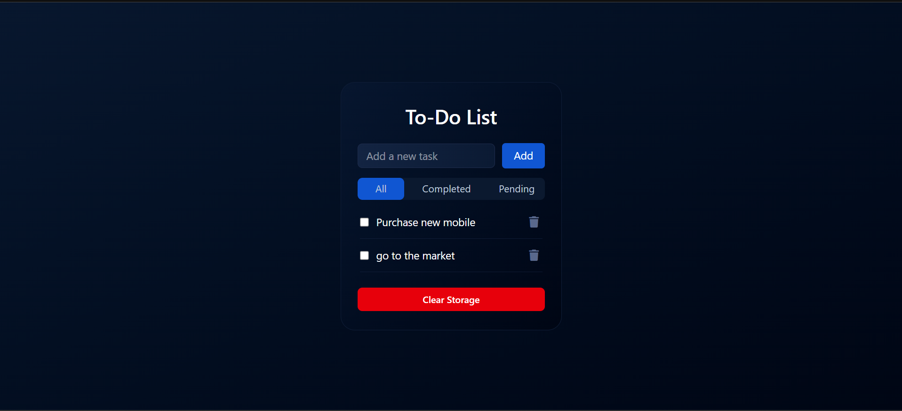
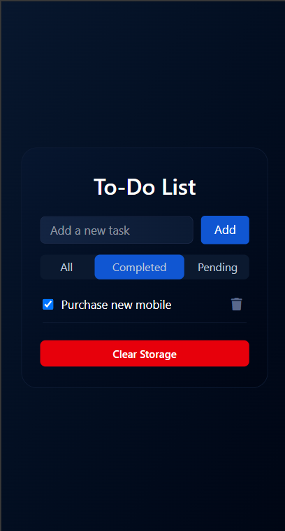

# 📝 To-Do List App

A clean and responsive To-Do List app built using **HTML**, **Tailwind CSS**, and **Vanilla JavaScript**. This project allows users to manage their tasks efficiently with features like filtering, completion tracking, and task deletion.

---

## 🔗 Live Demo

👉 [View Project on GitHub Pages](https://panchal-zeel.github.io/todo-list-app-tailwind/)

---

## 📸 Project Screenshots

### 💻 Desktop View


### 📱 Mobile View


---

## 🚀 Features

- ➕ Add new tasks
- ✅ Mark tasks as completed using checkboxes
- 🗂 Filter by: **All**, **Completed**, **Pending**
- 🗑 Delete tasks
- 🎨 Styled using **Tailwind CSS**
- ⚡ Real-time UI updates

---

## 🛠️ Tech Stack

| Tech         | Purpose                      |
|--------------|------------------------------|
| HTML         | Page structure               |
| Tailwind CSS | Styling and layout           |
| JavaScript   | Functionality and interactivity |

---

## 🧪 How to Use

1. Type your task and click **Add**
2. Use checkboxes to mark tasks as **Completed**
3. Use filter buttons (**All**, **Completed**, **Pending**) to view tasks
4. Click 🗑 icon to delete any task

---

## 📁 Project Structure

```
📦 Project Folder/
├── index.html        # Main HTML file
├── input.css         # Tailwind source file
├── project8.css      # Compiled Tailwind CSS
├── script.js         # All JS logic
├── package.json      # Tailwind config
└── .gitignore        # Files to be ignored by Git
```

## 🙅‍♂️ Ignored Files

These are not uploaded to GitHub:

- `node_modules/`
- `.vscode/`
- Tailwind build cache (if any)

✔️ Already handled via `.gitignore`.

---

## 👨‍💻 Author

**Zeel Panchal**    
[GitHub Profile](https://github.com/Panchal-Zeel/)

---

